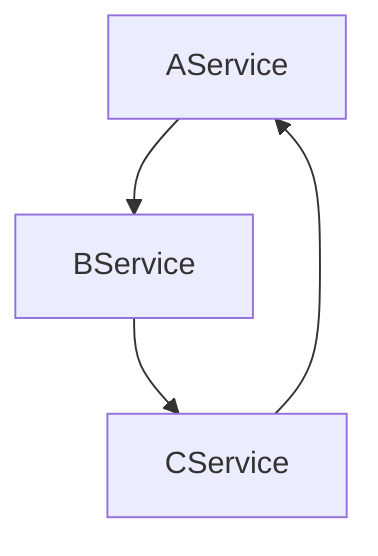

## 简介

> 依赖注入（`Dependency Injection`）是用于实现`IOC`（`Inversion of Control`，控制反转）的最常见的方式之一，可以达到解耦的目的。
> 
> 常见的`IOC`框架：

| IOC框架                                                                | 说明                |
| -------------------------------------------------------------------- | ----------------- |
| `ServiceCollection`                                                  | .NET Core内置的IOC容器 |
| [`Autofac`](https://github.com/autofac/Autofac)                      |                   |
| [`SimpleInjector`](https://github.com/simpleinjector/SimpleInjector) |                   |
| **Sean.Core.DependencyInjection**                                    | 当前项目              |

## Packages

| Package                                                                                        | NuGet Stable                                                                                                                                                        | NuGet Pre-release                                                                                                                                                      | Downloads                                                                                                                                                            |
| ---------------------------------------------------------------------------------------------- | ------------------------------------------------------------------------------------------------------------------------------------------------------------------- | ---------------------------------------------------------------------------------------------------------------------------------------------------------------------- | -------------------------------------------------------------------------------------------------------------------------------------------------------------------- |
| [Sean.Core.DependencyInjection](https://www.nuget.org/packages/Sean.Core.DependencyInjection/) | [](https://www.nuget.org/packages/Sean.Core.DependencyInjection/) | [](https://www.nuget.org/packages/Sean.Core.DependencyInjection/) | [](https://www.nuget.org/packages/Sean.Core.DependencyInjection/) |

## Nuget包引用

> **Id：`Sean.Core.DependencyInjection`**

- Package Manager

```
PM> Install-Package Sean.Core.DependencyInjection
```

## 说明

> 实现原理：反射 + 递归（依赖解析） + 缓存

- 本项目支持依赖注入的方式：构造函数
- 如果`ImplementationInstance`和`ImplementationFactory`属性均为null，那么会通过`ImplementationType`属性选择一个适合的构造函数来创建最终的服务实例。

```
我们知道class类可以定义了多个构造函数，那么针对构造函数的选择会采用怎样的策略呢？

单个构造函数：直接解析

多个构造函数解析依赖时，默认优先选择顺序为：
1. 包含[DependencyInjectionAttribute]的构造函数；
2. 无参构造函数；
3. 按参数数量倒序遍历全部有参构造函数，直到找到可以提供所有参数的构造函数（优先解析参数数量最多的构造函数）；
```

- 依赖注入解析时，如果是无法解析的类型，会抛出异常 `UnresolvedTypeException`
- 依赖注入解析时，如果发现循环依赖，会抛出异常 `CircularDependencyException`



```
问：为什么需要抛出异常？没有解决方案吗？
答：因为如果不抛出异常，会导致依赖解析出现死循环，直到内存耗尽，系统崩溃，这是非常致命的。

注意：出现循环依赖是设计上的问题，一定要避免！
```

## 使用示例

> 项目：examples\Example.NetCore
